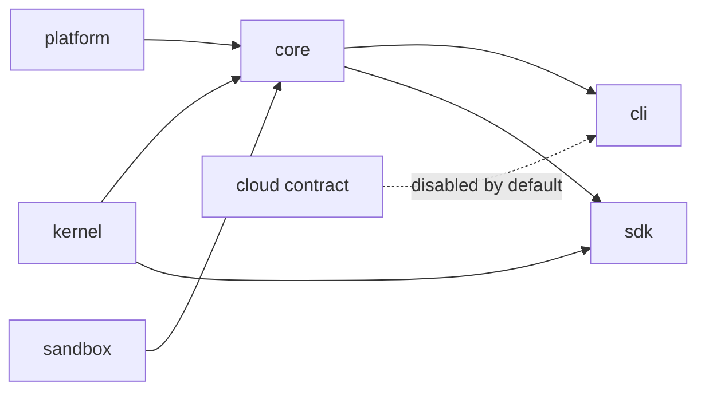

<div align="center">

<!-- App icon above, wordmark below. Both are colored on transparency and deliberately not
     a <picture>: prefers-color-scheme follows the operating system while the GitHub theme
     is an account setting, so whenever the two disagree a monochrome variant lands on the
     opposite background and disappears. lockup-light / lockup-dark stay for in-app use. -->

<br><br>


<br>

**A local-first AI coding agent for the terminal, with an embeddable SDK on the same runtime.**
Bring your own model. No account, no gateway, no telemetry.

<br>

[](https://github.com/neoxlabs/OpenNeox/actions/workflows/ci.yml)
[](LICENSE)
[](package.json)
[](tsconfig.json)
[](#hosts)

[Architecture](docs/architecture.md) · [Status](docs/status.md) · [Contributing](CONTRIBUTING.md) · [Security](SECURITY.md)

</div>

---

## What this is

OpenNeox is the Neox CLI and the runtime underneath it. A single TypeScript
runtime — provider-neutral agent loop, tool catalog, permission model, OS sandbox,
session storage — is exposed through two hosts: the `neox` terminal agent and an
embeddable SDK.

Models are supplied by the operator. The runtime speaks fourteen wire protocols
directly and ships fifteen provider presets; it has no built-in gateway, no
subscription, and no default endpoint of its own. Sessions, checkpoints,
memory, and credentials stay on the machine that runs the agent.

The repository is the production runtime, not a demo extraction, and its CI gates
must pass on every push.

---

## Capabilities

### Agent runtime

`StreamedRunner` (`packages/kernel/src/core/runner.ts`) drives one turn: prepare
messages, filter the tool catalog against mode and model profile, open a streamed
request, accumulate text and tool calls, validate each call, take it through the
permission manager and guardrails, execute, append the result, and request the
next turn — until the model stops, the caller cancels, or an iteration or tool
budget is spent.

The loop is bounded and observable by construction: stream retry with partial-output
tracking, duplicate tool-call detection, reasoning-loop detection, tool-pair
validation, cancellation, and phase/run tracing. `runtimeOrchestrator.ts` resolves
the provider and model, opens a checkpoint baseline, and can route to an
alternate provider supplied by the host.

### Models

Adapters normalize tool schemas, thinking controls, stream events, and message
pairing per protocol — compatibility is handled at the adapter boundary rather
than assumed.

| Protocol family | Adapters |
| --- | --- |
| OpenAI | `openai`, `openai-responses` |
| Anthropic | `anthropic`, `anthropic-openai`, `glm-claude`, `kimi-claude` |
| Google | `gemini` |
| Others, native | `deepseek`, `kimi`, `glm`, `qwen`, `minimax`, `doubao`, `grok` |
| OpenAI-compatible, via preset | OpenRouter, Mistral, Groq, Together AI, Dashscope, opencode Zen |

A provider configuration is an API key, a model, and an optional base URL. Presets
in `packages/kernel/src/models/providerPresets.ts` supply base URLs, capability
flags, and known models; anything OpenAI- or Anthropic-compatible works without a
preset, including a local endpoint.

### Tools

235 tools in 32 packs. A host exposes a small catalog first and promotes deferred
tools when the model asks for them, so the prompt does not carry the whole
surface. The resulting set is then filtered by agent mode, model constraints,
sandbox policy, and permission decisions before anything executes.

| Domain | Packs |
| --- | --- |
| Code | file operations, search and browse, code intelligence, quality, Git, worktrees |
| Execution | shell and scripts, Python/JavaScript/Bash/PowerShell interpreters, dev-server management, terminal, debug, Java debug |
| Web | fetch and search, embedded browser automation, multi-angle deep research with an evidence ledger |
| Documents | Excel/CSV, Word, PowerPoint, document reading, image generation |
| System | macOS native app control, scheduling and cron, task management, project memory, knowledge base |
| Orchestration | sub-agents, team mode, plan mode, skills, MCP |

MCP servers are configured as user-owned integrations (`packages/core/src/mcp`).
Skills are defined in `packages/core/src/skills`.

### Boundaries

Three independent layers, none of which substitutes for another:

- **Permissions.** `PermissionManager` decides per tool call. Connector access uses
  a typed capability contract — a resource plus a verb, classified read-only,
  writing, destructive, or costly — and the host enforces the grant lifecycle.
- **Sandbox mode.** A coarse per-run policy in the kernel that gates whole tool
  categories.
- **OS sandbox.** `packages/sandbox` compiles a four-axis policy into a spawn
  specification against macOS Seatbelt, Linux bubblewrap or unshare, or Windows
  AppContainer / restricted token, with a direct-shell fallback that reports the
  degraded reason rather than failing silently. The package has no runtime
  dependency on the rest of the tree.

A plugin manifest *declares* tools, MCP servers, hooks, views, connector
mappings, external agents, and auth providers. The host stays the only place
that holds credentials, resolves approval, and executes.

### Storage

SQLite, keyed by workspace and session. `sessionScope.ts` carries the active
session so session-scoped stores cannot share module state; the store factory
creates agent, progress, message, task, registry, interrupted-run, and snapshot
stores against a database and a workspace path. Checkpoints bind a message turn
to a file baseline so a turn can be reverted as a unit.

---

## Hosts

| Host | Entry | Notes |
| --- | --- | --- |
| CLI | `apps/cli/src/main.ts` | Ink terminal UI, binary `neox`, runs anywhere Node 20 runs |
| SDK | `packages/sdk/src/index.ts` | `Agent`, `tool`, `createSession`, `provider`; embed the agent in your own Node app |

---

## Quick start

Requires Node.js 20 or newer and npm.

```bash
git clone https://github.com/neoxlabs/OpenNeox.git
cd OpenNeox
npm ci
npm run build

node apps/cli/dist/cli/main.js --version
```

Configure a provider with your own API key through `neox provider`. Packages are
not published to npm yet; build from source.

### SDK

```ts
import { Agent, tool } from '@openneox/sdk';
import { z } from 'zod';

const agent = new Agent({
  model: 'claude-sonnet-5',
  tools: [
    tool({
      name: 'read_invoice',
      description: 'Read one invoice by id',
      schema: z.object({ id: z.string() }),
      handler: async ({ id }) => db.invoices.get(id),
      readOnly: true,
    }),
  ],
});

const result = await agent.run('Summarise invoice INV-204');
console.log(result.text);
```

`createSession` keeps turns and tool state across calls. `provider` and
`providerFromEnv` select the model backend. Permission decisions are handled by a
`PermissionHandler` supplied by the embedding application.

---

## Repository layout

```
apps/
  cli/            Terminal host and command router
packages/
  kernel/         Agent loop, message and tool types, permissions, providers
  platform/       Config, SQLite, logging, process services, model registry
  core/           Runtime, tools, model adapters, sessions, MCP, skills, server
  sdk/            Consumer-facing Agent and session API
  sandbox/        OS sandbox policy compiler and spawn backends
  cloud/          Optional capability contract, disabled by default
  workflow/       Workflow orchestration (design stage, not usable yet)
  evals/          Evaluation harness
  pptx-compose/   Deck composition
  pptx-renderer/  Deck rendering
  cluster/        Multi-process coordination (design stage; team mode lives in core)
  devtools/       Development tooling
  native/         Native bindings
  test-harness/   Shared test infrastructure
plugins/          Public plugin implementations
docs/             Architecture, status
scripts/          Build, release and CI gate scripts
```

Packages must not import from `apps`. The direction is enforced by
`npm run check:boundaries`, which fails the build rather than warning.



---

## Extending

**Plugins.** A manifest (`packages/platform/src/shared/plugin-types.ts`) declares
tools, hooks, MCP servers, connector mappings, external agents, and auth
providers; the host keeps credentials, approval, and execution.

**Skills and MCP.** Skills are folders under `~/.neox/skills`; MCP servers are
user-owned integrations configured per workspace or globally.

---

## Open source and commercial editions

This repository is the whole local CLI runtime. It does not contain accounts,
subscriptions, a hosted marketplace, a model gateway, or the Neox desktop and
mobile apps; the hosted services are represented only by the capability contract
in `packages/cloud`, whose default implementation is a disabled no-op.

A commercial distribution supplies its own implementation behind that contract.
It does not require a fork, and no file in this tree carries a branch for an
edition it does not ship.

Licensed under [Apache 2.0](LICENSE): commercial use, modification and
distribution are permitted, with a patent grant and attribution requirements.
Third-party materials retain their own licenses — see [NOTICE](NOTICE).

---

## Development

```bash
npm run type-check      # runtime, CLI and tests
npm test                # unit tests
npm run check:arch      # boundaries, exports, specifiers, native dialogs, size, mocks
npm run audit:comments  # comment quality gate, passes at zero findings
npm run check:licenses  # third-party license metadata
```

The runtime targets Node 20 or newer; the test suite needs Node 22, because the
session-context tests build a real database through `node:sqlite`. Source-scanning
guard tests require `ripgrep`, and the shell-invocation regression requires `zsh`.

CI runs all of the above plus the build. The gates are not advisory; each one exists because it caught a regression that type
checks and unit tests did not.

Conventions worth reading before a first commit are in
[docs/status.md](docs/status.md), and the repository boundary rules — what must
never be added to a public build — are in [AGENTS.md](AGENTS.md).

---

## Contributing and security

Read [CONTRIBUTING.md](CONTRIBUTING.md) and [CODE_OF_CONDUCT.md](CODE_OF_CONDUCT.md)
before opening a change. Report vulnerabilities through [SECURITY.md](SECURITY.md)
rather than a public issue.
