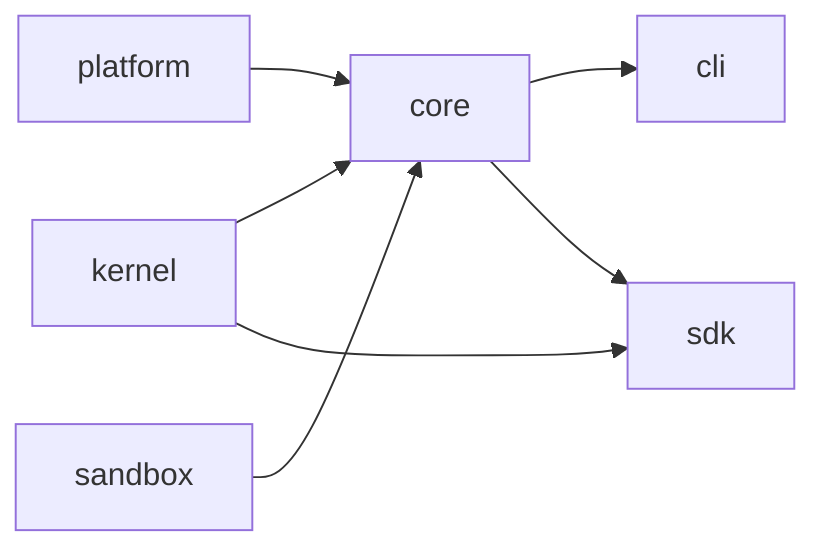

<div align="center">

<!-- App icon above, wordmark below. Both are colored on transparency and deliberately not
     a <picture>: prefers-color-scheme follows the operating system while the GitHub theme
     is an account setting, so whenever the two disagree a monochrome variant lands on the
     opposite background and disappears. -->

<br><br>


<br>

**An open-source AI coding agent for your terminal.**<br>
Bring your own model. No account, no gateway, no telemetry.

<br>

**English** · [简体中文](README.zh-CN.md)

<br>

[](https://github.com/neoxlabs/OpenNeox/actions/workflows/ci.yml)
[](LICENSE)
[](package.json)
[](#quick-start)

</div>

---

`neox` reads your code, runs commands, edits files, and checks its own work — inside
the repository you point it at, with the model you choose. Everything runs on your
machine: sessions, checkpoints, memory, and API keys never leave it unless a model
request does.

- **Any model.** OpenAI, Anthropic, Gemini, DeepSeek, Kimi, GLM, Qwen, MiniMax,
  Doubao, Grok, OpenRouter, Groq, Mistral, a local endpoint — anything that speaks
  the OpenAI or Anthropic protocol.
- **Real tools.** File editing, search, shell, Git and worktrees, code intelligence,
  interpreters, browser automation, web research, Office documents, MCP, skills,
  and sub-agents.
- **Safe by default.** Every tool call goes through a permission check; shell
  commands can run inside an OS sandbox (Seatbelt on macOS, bubblewrap on Linux,
  AppContainer on Windows).
- **Undo a whole turn.** Checkpoints snapshot the files a turn touched, so
  `/rollback` takes the workspace back to before the agent started.
- **Scriptable.** `neox -p` runs one prompt and prints the result — plain text,
  JSON, or output that matches a JSON Schema — for CI and shell pipelines.
- **Embeddable.** The same runtime ships as an SDK for your own Node apps.

## Quick start

Requires Node.js 20 or newer. Packages are not on npm yet, so build from source:

```bash
git clone https://github.com/neoxlabs/OpenNeox.git
cd OpenNeox
npm ci
npm run build
npm link            # puts `neox` on your PATH
```

Add a model key. The interactive wizard stores it locally:

```bash
neox provider add
```

Or export one and `neox` picks it up:

```bash
export ANTHROPIC_API_KEY=sk-ant-...     # also: OPENAI_API_KEY, GEMINI_API_KEY,
                                        # MOONSHOT_API_KEY, DOUBAO_API_KEY
                                        # (+ *_BASE_URL for compatible endpoints)
```

Then start it in any project:

```bash
cd your-project
neox
```

## Usage

```bash
neox                              # interactive session in the current directory
neox "why does the login test fail?"    # one prompt, print the answer, exit
neox -c                           # continue the most recent session
neox -r                           # pick a past session to resume
neox -m <model> --provider <id>   # choose the model for this run
neox -d ../other-repo             # work in another directory
```

Non-interactive mode for scripts and CI:

```bash
neox -p "summarise the changes on this branch"
neox -p --json "list the TODOs in src/"                 # one JSON object on stdout
neox -p --output-schema schema.json "extract the API routes"
neox -p --yolo "fix the lint errors"                    # allow edits and commands
```

`-p` is read-only unless you pass `--yolo`.

Inside a session:

| Command | What it does |
| --- | --- |
| `/session ls` · `/session new` · `/session export` | Manage sessions |
| `/checkpoint create [name]` | Snapshot the workspace |
| `/rollback <id>` | Restore a checkpoint |
| `/provider` · `/model` | Switch provider or model |

Management commands:

| Command | What it does |
| --- | --- |
| `neox provider ls \| add \| test [id]` | Manage model providers |
| `neox model ls` | List available models |
| `neox mcp …` | Manage MCP servers |
| `neox skill …` | Manage skills |
| `neox daemon …` | Background daemon |

Run `neox --help` for the full list.

## Models

A provider is an API key, a model, and an optional base URL. Presets in
`packages/kernel/src/models/providerPresets.ts` supply base URLs, capabilities, and
known models. Adapters normalize tool schemas, thinking controls, stream events,
and message pairing for each protocol:

| Protocol family | Adapters |
| --- | --- |
| OpenAI | `openai`, `openai-responses` |
| Anthropic | `anthropic`, `anthropic-openai`, `glm-claude`, `kimi-claude` |
| Google | `gemini` |
| Others, native | `deepseek`, `kimi`, `glm`, `qwen`, `minimax`, `doubao`, `grok` |
| OpenAI-compatible presets | OpenRouter, Mistral, Groq, Together AI, Dashscope, opencode Zen |

Anything OpenAI- or Anthropic-compatible works without a preset, including a model
served on your own machine.

## Safety model

Three independent layers; none substitutes for another.

- **Permissions** — `PermissionManager` decides on every tool call. Reads, writes,
  destructive operations, and costly operations are classified separately.
- **Sandbox mode** — a per-run policy that switches whole tool categories on or off.
- **OS sandbox** — `packages/sandbox` compiles a policy into a Seatbelt,
  bubblewrap/unshare, or AppContainer spawn. If no backend is available it falls
  back to a direct shell and says why, rather than failing silently.

## SDK

```ts
import { Agent, tool } from '@neoxlabs/sdk';
import { z } from 'zod';

const agent = new Agent({
  model: 'claude-sonnet-5',
  tools: [
    tool({
      name: 'read_invoice',
      description: 'Read one invoice by id',
      schema: z.object({ id: z.string() }),
      handler: async ({ id }) => db.invoices.get(id),
      readOnly: true,
    }),
  ],
});

const result = await agent.run('Summarise invoice INV-204');
console.log(result.text);
```

`createSession` keeps turns and tool state across calls; `provider` and
`providerFromEnv` pick the backend; your app supplies a `PermissionHandler`.

## How it is built

```
apps/cli/         the `neox` terminal app (Ink)
packages/
  kernel/         agent loop, providers, message and tool types, permissions
  platform/       config, SQLite storage, logging, model registry
  core/           runtime, tools, model adapters, sessions, MCP, skills
  sdk/            the embeddable Agent / session API
  sandbox/        OS sandbox policy compiler and spawn backends
  cloud/          optional capability contract, disabled by default
  …               evals, workflow, cluster, pptx, native, devtools, test-harness
plugins/          public plugin implementations
```



One turn: the orchestrator resolves the provider and model and opens a checkpoint;
`StreamedRunner` streams the response, validates each tool call, runs it through
permissions and the sandbox, appends the result, and repeats until the model
stops, you cancel, or a budget runs out. Details in
[docs/architecture.md](docs/architecture.md).

## Development

```bash
npm run type-check      # TypeScript, strict
npm test                # unit tests (Node 22: the session tests use node:sqlite)
npm run check:arch      # package boundaries, exports, specifiers
npm run audit:comments  # comment quality gate
npm run check:licenses  # license metadata
```

Source-scanning tests need `ripgrep`; the shell regression tests need `zsh`.
Packages must not import from `apps` — `npm run check:boundaries` fails the build
if they do.

## License

[Apache 2.0](LICENSE). Third-party materials keep their own
licenses — see [NOTICE](NOTICE).

## Contributing

Read [CONTRIBUTING.md](CONTRIBUTING.md) and [CODE_OF_CONDUCT.md](CODE_OF_CONDUCT.md)
before opening a change, and [docs/status.md](docs/status.md) for what is in
progress. Report vulnerabilities through [SECURITY.md](SECURITY.md), not a public
issue.
