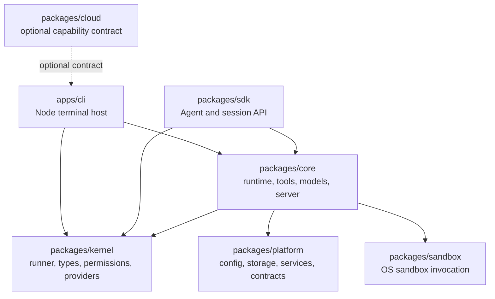

# OpenNeox Architecture

This document is a source-oriented guide to the repository for developers who are
new to OpenNeox. The repository is a workspace monorepo: reusable TypeScript
packages provide the agent runtime, and the `neox` CLI is the host that puts a
terminal interface on it. The most useful starting points are the package entry
points and the host composition code listed in each section below.

## Layers and Dependency Direction

The system has five practical TypeScript layers. The **kernel** is the provider-
agnostic execution contract. `packages/kernel/src/index.ts` exports
`StreamedRunner`, the message and tool types, permission primitives, provider
implementations, short-term memory, sandbox-mode state, session scope, and host
capability registration. It makes no assumptions about the UI that hosts it.

The **platform** layer contains host infrastructure such as configuration,
SQLite access, logging, process services, model registries, and shared contracts.
Its public entry point, `packages/platform/src/index.ts`, intentionally exposes
very little; concrete consumers import the relevant modules under
`packages/platform/src/platform`, `packages/platform/src/utils`, and
`packages/platform/src/shared`. This keeps importing a type or small service from
pulling in every platform dependency.

The **core** layer assembles the kernel and platform into a complete runtime.
`packages/core/src/sdk/index.ts` exposes runtime hosts, the orchestrator,
checkpoint services, Node services, tool assembly, server adapters, and
middleware. Runtime code lives under `packages/core/src/runtime`, tools under
`packages/core/src/tools`, model adapters under `packages/core/src/models`, and
memory and persistence under `packages/core/src/memory` and
`packages/core/src/runtime/store`.

The **SDK** is the smaller consumer-facing API. `packages/sdk/src/index.ts`
exports `Agent`, `tool`, `createSession`, and provider helpers, so an application
can create an agent with a few lines of code. The **apps** layer supplies the
host: `apps/cli/src/main.ts` runs the terminal product.

The intended dependency direction is inward toward contracts and runtime, with
host-specific services pointing inward through explicit interfaces. Packages must
not import from `apps`; `npm run check:boundaries` enforces it.

## Agent Loop

An agent turn starts at a host-specific runtime entry and is coordinated by
`packages/core/src/runtime/runtimeOrchestrator.ts`. The orchestrator resolves a
provider and model, starts a checkpoint baseline when one is available, creates
the runtime host, and forwards status and runtime events to the host. It can also
resolve an automatic model route and try alternate providers supplied by the
host.

The host eventually drives `StreamedRunner` from
`packages/kernel/src/core/runner.ts`. The runner prepares the current messages,
filters tools according to the mode and model profile, and opens a streamed LLM
request. It accumulates text and tool calls from the stream. A tool call is
validated and passed through the permission manager and guardrails before
execution. Tool results are appended to the conversation, and the loop requests
the next model turn until the model returns without a tool call, the caller
cancels, or a configured iteration/tool budget is reached.

The runner also contains the controls that make a long-running loop observable
and bounded: stream retry and partial-output tracking, duplicate tool-call
detection, reasoning-loop detection, tool-pair validation, cancellation, and
phase/run tracing. `packages/core/src/runtime/agentRuntimeHost.ts` and
`packages/core/src/runtime/runtimeHostService.ts` adapt this kernel loop to a
workspace session, while the event hub and action-log modules expose progress to
the host UI.

## Tools

Tool definitions are assembled by core rather than hard-coded into the kernel.
`packages/core/src/tools/index.ts` exports code-interpreter tools, terminal and
editor tools, and guarded write wrappers. Runtime assembly is exposed through
`packages/core/src/sdk/index.ts` (`getTools` and `setToolServices`) and is
configured by the host's platform services and workspace.

The tool tree and pack system allow a host to expose a small catalog first and
promote deferred tools when the model needs them. MCP support is implemented in
`packages/core/src/mcp`, while skills are implemented in `packages/core/src/skills`.
The resulting tool set is still filtered by agent mode, model constraints,
sandbox policy, and permission decisions before execution. Kernel code never
needs to know how a host renders a tool event.

## Providers and Models

The kernel owns protocol-level providers. `packages/kernel/src/index.ts` exports
`OpenAIProvider`, `OpenAICompatibleClient`, and `AnthropicProvider`, together
with the common `LLMProvider`, message, tool, and stream-event types. A provider
configuration normally supplies an API key, model, and optional base URL.

Core adds adapters and constraints in `packages/core/src/models/adapters` and
`packages/core/src/models/constraints`. The adapter factory in
`packages/core/src/models/factory.ts` selects behavior by protocol, while
`packages/kernel/src/models/providerPresets.ts` supplies user-facing provider
templates, base URLs, capabilities, and common models. Model profiles are
resolved by `packages/kernel/src/profiles/index.ts`.

Compatibility mode means that a provider can speak an established wire protocol
while applying provider-specific request and response rules. For example, the
OpenAI-compatible client is configured with a provider base URL, and core has
separate adapters for providers whose OpenAI-compatible or Anthropic-compatible
behavior needs normalization. This is a protocol abstraction, not a requirement
that every provider expose identical features. Tool schemas, thinking controls,
stream events, and message pairing are normalized at the adapter boundary.

## Plugins and Permissions

Plugin manifest types live in `packages/platform/src/shared/plugin-types.ts`.
A manifest can declare tools, MCP servers, hooks, connector mappings, external
agents, authentication providers, dependencies, and configuration fields.

Permissions are layered. Kernel `PermissionManager` and
`packages/kernel/src/core/permissions` make tool approval decisions. Sandbox
mode in `packages/kernel/src/core/sandboxMode.ts` provides a separate coarse
policy for the current run. Connector permissions use the typed capability
contract in `packages/platform/src/shared/plugin-connector.ts`: capabilities
combine a resource and verb, and are classified as read-only, writing,
destructive, or costly. Plugin declarations therefore describe requested access;
the host remains the place where credentials, approval, and execution are
controlled.

## Sandbox

`packages/sandbox/src/index.ts` is a standalone policy compiler. It converts a
four-axis sandbox policy into a spawn specification and selects a platform
backend: macOS Seatbelt, Linux bubblewrap or unshare, Windows AppContainer or a
restricted token, with a direct-shell fallback when no backend is available.
The package intentionally has no Neox runtime dependency. A shell adapter chooses
the tier and performs the spawn; the package reports a degraded reason when it
must fall back. Kernel sandbox mode and this OS-level invocation layer are
related but separate: the former gates tool categories, while the latter
constrains the child process.

## Storage and Sessions

The runtime treats workspace and session identity as first-class data.
`packages/kernel/src/core/sessionScope.ts` carries the active session context so
session-scoped stores do not accidentally share module-level state.
`packages/core/src/runtime/store/index.ts` creates the agent, progress, message,
task, registry, interrupted-run, and snapshot stores against a database and a
workspace path. `packages/core/src/runtime/store/AgentStore.ts` shows the
workspace predicate used for isolation.

Conversation-window memory is provided by
`packages/kernel/src/memory/shortterm.ts`. Core memory modules add dynamic project
context and persistent session handling. Checkpoints are coordinated by
`packages/core/src/runtime/checkpoint`, allowing a host to associate a message
turn with a file baseline. Platform storage services and SQLite schema modules
provide the concrete Node persistence layer.

## CLI

`apps/cli/src/main.ts` is the Node host and command router. It loads configuration
and provider state, can connect to the core server/client path, initializes the
Ink terminal UI, and supplies command-specific contexts for model, mode, service,
MCP, attachment, workspace, and diagnostic commands. Its platform services and
approval presentation are terminal-oriented; everything below it is the shared
runtime.

## Cloud Contract

The cloud boundary is deliberately optional. `packages/cloud/src/index.ts`
defines `CloudCapabilities` for authentication, membership, model gateway,
marketplace, and cloud-session availability. It supplies a disabled no-op object
by default. `registerCloud` accepts a real implementation only when the build
constant `__NEOX_CLOUD__` is true; otherwise `cloud()` remains unavailable.
This is the extension contract for a hosted integration without forcing cloud
runtime dependencies into the open core.

Together, these boundaries let a host choose its runtime services while keeping
the kernel, core contracts, sandbox policy, and SDK usable without a hosted
service.
